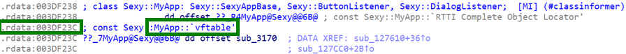
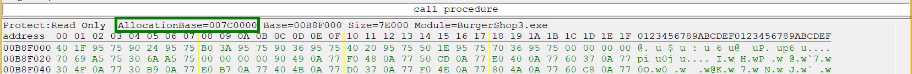
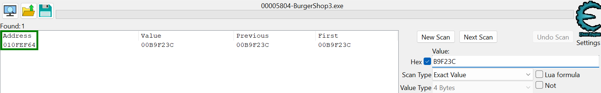
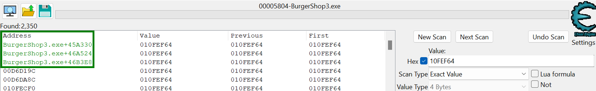
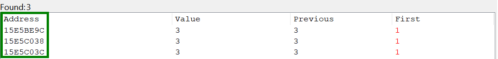
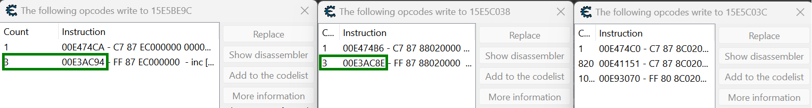

# Burger Shop 3 Hooking 4 Dummies

> **Disclaimer**: This guide assumes you have basic programming knowledge, and while a passing familiarity with assembly is helpful, we'll try to keep things *relatively* newbie-friendly. If you find your brain overheating from all this disassembly talk, try eating some ice cream. It's a well-known fact that ice cream cools down the brain.  
> Even if you are a seasoned programmer, hooking is still a complex topic. If you're new to it, expect to spend a lot of time debugging and troubleshooting. It's a learning process, so don't get discouraged if things don't work right away.  
> Also note that this is not a guide to the tools used, but rather a guide on how to use them to hook into Burger Shop 3. If you're not familiar with the tools, you might want to look up some tutorials on them first. This document would be longer than the Harry Potter series if we explained everything about them. (That's 500,000 TikToks, if you prefer modern units of measurement.)

## What Is Hooking?
Hooking is a technique used to intercept (or "hook") function calls at runtime. You do this by:
1. Replacing the initial bytes of a target function with your own assembly jump.
2. Sending execution flow to your custom function (where you can do cool or mischievous things).
3. Optionally calling the original function afterward (or before).

But thankfully, you don't need to worry about all that, as we have a library that does all the heavy lifting for you. You just need to write the hook function and the library will take care of the rest. What a time to be alive!

## Why Hook?
When you compile C++ code, it turns into assembly. Assembly is a cryptic language full of weird abbreviations, hex addresses, and enough jumps to give you motion sickness. Hooking lets you intercept the function *without* rewriting all that assembly by hand. It's a lot easier to write a hook function in C++ than to write the entire function in assembly.

However, hooking does require you to:
1. Identify the function's address.
2. Know its calling convention (the rules for passing parameters and returns).
3. Understand the function's parameters and return types.

Additionally, you may need to know information about variables and functions that you want to use in your hook.

But hey! At least you don't have to write the entire function in assembly. That's a win in my book.

I'm sure this is all very confusing, but don't worry, the next section will give a practical example.

## Tools You'll Need
- **Disassembler** (IDA Pro, Ghidra, etc.): To see how the game's code is structured.  
- **Cheat Engine (32-bit)**: For memory editing, pointer scanning, and capturing addresses.  
- **MSVC Compiler & IDE** (Visual Studio 2022+ recommended): To compile your hooking code.  
- **This Repository (or the compiled library)**: Provides a hooking library that simplifies your life (or so we hope).  
- **ReClass.NET (Optional but recommended)**: For visualizing and mapping game structures in memory.

**Notes**:
- If you're using IDA, consider installing the Class Informer plugin to speed up your detective work.  
- Cheat Engine's installer might try to slip you "special offers" (read: adware). Uncheck all boxes during installation or use the portable version.
- ReClass.NET helps you create custom classes for memory structures. This is useful for organizing memory structures and making them easier to work with. It's not required, but highly recommended. A structure map for the game's latest version is available at [ingoh.net/bs3struct](https://ingoh.net/bs3struct).

## Step 1: Finding a static pointer to the root class
### Our Target: `MyApp`
- In Burger Shop 3, the "root class" is called `MyApp`.  
- There's (normally) only one instance of `MyApp`. If there are more, your computer is probably haunted. Try burning some sage.

### The General Plan
1. **Find `MyApp` in the Disassembler**  
   - Use Class Informer or text references in IDA (or Ghidra) to locate the class.  
   - Identify the vftable (virtual function table) inside `MyApp`. Classes with virtual functions have a pointer to their vftable at the start of the object.
   - There are two `MyApp` classes in the disassembler. We want the first. The second one is for implementing the DialogListener interface, and we don't want that one. It's an impostor!  
2. **Get the vftable Address**  
   - Write down the address where IDA says the vftable starts (e.g., `0x3DF23C`).  
   - Keep in mind IDA and other disassemblers might show addresses offset by `0x400000` (for this particular game). You can "Rebase Program" to 0x0 or just do mental arithmetic.  
3. **Check the Game's Allocation Base**  
   - In Cheat Engine, attach to the game and open "Memory View."  
   - Look for `AllocationBase`; suppose it's `0x7C0000`. Add that to the offset from IDA (`0x3DF23C` + `0x7C0000` = `0xB9F23C`).  
4. **Search in Cheat Engine**  
   - Do a 4-byte hex scan for `0xB9F23C`.  
   - You might find one or more addresses that hold that value. If one address is `0x10FEF64`, that's the pointer used by the `MyApp` object to access its vftable.  
5. **Locate the Static Pointer**  
   - Now search for `0x10FEF64` again in Cheat Engine, and you might see multiple references. The ones in green are **static** pointers (e.g., `BurgerShop3.exe+45A330`).
   - **Pick one of those** to be your anchor. That's your stable pointer to `MyApp`. For convention, using the first one is recommended.  

**Why Bother?**  
If you rely on dynamic addresses, your pointer might be valid one run and useless the next. Static pointers persist across game sessions—super handy for hooking. Just remember that when the game updates, these addresses might still change, so you'd have to locate them again. Life's a game of cat and mouse, and so is modding Early Access games.


*Here you can see that the MyApp class starts at 0x3DF238, with the vftable at 0x3DF23C.*

Once you have the address of the vftable, open Cheat Engine and attach it to the game process. Take note of the base address of the game in memory (AllocationBase) and add the vftable address to it to get the final address of the vftable pointer.


*Here you can see the allocation base of the game is 0x7C0000, meaning the vftable should be at (0x3DF23C + 0x7C0000) = 0xB9F23C.*

We'll type this final address into the Cheat Engine value search to find the pointer to this vftable. Make sure to set the value type to 4 bytes and check the "Hex" box. If you forget to do this, you'll get 3 years of bad luck. Just kidding, you'll just get incorrect results.


*We can see that only one address is found, 0x10FEF64. This is the pointer used by the `MyApp` object to access its vftable, and the address itself is the pointer to the `MyApp` object.*

Now we just need to search for this new address in Cheat Engine the same way we did for the vftable pointer. This will give us all pointers to the `MyApp` object. This works because the vftable is at the very beginning of the object's memory layout, so the object pointer is the same as the vftable pointer. Not all objects have vftables though, but most large ones do, especially ones that are part of a class hierarchy (meaning they have virtual functions).


*We can now see that there are 2,350 pointers to the `MyApp` object. There are three colored in green, which are static pointers. These are the ones we want. The pointers are BurgerShop3.exe+45A330, BurgerShop3.exe+46A524, and BurgerShop3.exe+46B3E8. To my knowledge, all three of them should work without any issues, but for standardization, we'll use the first one.*

You'll probably get lots of results, but we are only interested in the ones that are static, colored in green. At the time of writing, there should be three of them. It's possible that this might change in the future. In case there are no static pointers at all after an update, you may need to use a technique called pointer scanning to find the pointer. This is a more advanced technique and is not covered in this guide, but there are resources available online that can help you with this.  
And that's it! We now have a static pointer to the root class of the game. This pointer will always point to the same memory address, no matter how many times you run the game. This is the first step to hooking into the game.  
Keep in mind that these static pointers change between updates, so you will need to find them again if the game updates.  
Note that BurgerShop3.exe is the base address of the game in memory, the same as the allocation base we found earlier. This changes every time you run the game, but fortunately there are easy ways to get this with all tools. Technology is amazing, isn't it?

### Cheat Engine
Cheat Engine uses `"BurgerShop3.exe"` to denote the base address (quotes required).  
For an address relative to the base address, use `"BurgerShop3.exe"+####`.  
For a pointer or pointer chain, use the `Pointer` value type and fill in the offset(s).

### ReClass.NET
ReClass.NET uses `<BurgerShop.exe>` to denote the base address (angle brackets required).
For an address relative to the base address, use `<BurgerShop.exe>+####`
For a pointer or pointer chain, use square brackets, e.g. `[<BurgerShop.exe>+####]+####`.

### C++
For C++, you can use `MODULEENTRY32.modBaseAddr`. The hook library already handles this for you, so you don't need to worry about it; you can just call `GetBaseAddress()`.

## Step 2: Finding the function to hook
Obviously, this step depends on what you want to do.  
For this guide, we'll hook into the customer's spawn function and make all of them extremely impatient. (Evil laughter optional.)    
Where is this spawn function, you ask? Well, that's what we need to find out!  
There are many ways to go about finding a function, and explaining all of them would take too long. Instead, we'll give an example with some common strategies so you can get a general idea of how to find functions.

### Example: Using the customer count to find the spawn function
The game likely stores the number of visible customers in a variable. If we figure out which object this variable belongs to, we can find the function that updates it — probably the spawn function.
To find this variable, just keep searching for the current number of customers in Cheat Engine. You can do this by pausing the game and scanning for the number of customers, then unpausing and scanning for the new number. Repeat this process until you have a few addresses left. Remember that you'll need to do this in the same level, as the 'Board' object gets destroyed when leaving a level, changing the memory layout.  


*Here we can see that we have three addresses left, 0x15E5BE9C, 0x15E5C038, and 0x15E5C03C. The last two are adjacent.*

We end up with three addresses. The last two are right next to each other.
We'll now put these addresses in ReClass.NET to find out which object they belong to, if any.
Since the vftable pointers are before the customer count variable, we'll offset the addresses by -0x1000, then scroll up from offset 0x1000 until we find a vftable pointer.
Keep in mind there won't always be a vftable pointer, as some classes don't have vftables, and some variables don't have objects they belong to (e.g. static variables).


*We find that all three variables belong to the 'Board' object.*

It turns out all three variables belong to the same 'Board' object.
The 'Board' object is essentially the gameplay manager, holding the machines, customers, conveyor belt, etc.
This is great, because we have narrowed things down to a single object. Now we just need to find the function that updates the customer count variable.
It could be any one of these variables, so let's create a write watcher ("Find out what writes to this address") in Cheat Engine for all three of them and see which functions modify them.
We can restart the level and wait for three customers to spawn. Then, we check which instructions were used exactly three times.


*There are 7 instructions that write to the three addresses, but only two write exactly three times. These are 0xE3AC94 and 0xE3AC8E

We can see that the two addresses are written to from two instructions, but these instructions are very close to each other, meaning they're likely part of the same function. That's great, because we narrowed things down to one function.
We'll now subtract the base address of the game from the addresses to get the offsets, and then navigate to them in IDA.

*Since we restarted the game inbetween writing this guide, the base address is now 0xE20000, so the offsets are (0xE3AC94 - 0xE20000) = 0x1AC94 and (0xE3AC8E - 0xE20000) = 0x1AC8E.*

We press 'G' in IDA's disassembly view (not pseudocode) and type in the offset to navigate to the address. We then change to the pseudocode view (make sure it's synchronized) to see the decompiled code. We can now see that the two instructions are adjacent are belong to `sub_1AB40`. We see that the two instructions correspond to:
```cpp
++this[162];
++this[59];
```
And since we know that 'this' is the 'Board' object, we can apply the Board struct to the this argument at the top of the function to see the decompiled code in a more readable format. Writing structs is something you'll have to do yourself, but it's not too hard. You can use ReClass.NET to help you with this.
From what it looks like, this subroutine updates the customer vector, meaning it's likely (part of) the spawn function. If we check the xrefs (cross-references) to this function, we can see that it's called from two functions, `sub_72570` and `sub_72D10`.
From analyzing the two functions and their xref chains, the first one seems to contain some more customer spawning logic inside the game's update loop, and the second one seems to be some sort of data synchronization function. It seems like we can either stick with the current function (`sub_1AB40`) or hook into `sub_72570`. We'll go with the first as it's used after a customer is successfully spawned while the second is used to try spawning a customer.

## Step 3: Creating the hook
To start with creating the hook, we first need to determine the spawn function's signature and calling convention. For the most part, you can just copy this from the decompiler's generated pseudocode, but you need to keep in mind that the pseudocode is not always correct. Especially the types are often wrong, so you'll need to correct them yourself. The actual signature of the spawn function is:
```cpp
void __thiscall AfterSpawnCustomer(Board* this, Customer* cust);
```
`Board` and `Customers` are pretty big objects with a lot of members, but we don't need to know all of them. We can just create a struct with the members we need to access. It doesn't actually matter if they're complete, as long as we're writing the correct value types to the correct offsets. The values we're interested in are `mAngerTime1` through `mAngerTime5` at offset `0xE0` to `0xF0` and `mNumPatienceBars` at `0x18C`. For the sake of brevity, we'll skip over how to find the offsets of these members, but you can use the same techniques as before to find them. We can create a struct as follows:
```cpp
struct CustomerFragment {
    char padding1[222]; // 222 unknown bytes
    int mAngerTime1;
    int mAngerTime2;
    int mAngerTime3;
    int mAngerTime4;
    int mAngerTime5;
    char padding2[152]; // 152 unknown bytes
    int mNumPatienceBars;
    // Padding afterwards is not needed as we're just writing
}
```
We can now create a hook for the spawn function with MinHook. We'll use the hooking library from this repository, which is a wrapper around MinHook. The library is already set up to handle the base address and the hooking process for you, so you don't need to worry about that. You can just create a class that extends `HookBase` and override the necessary functions. The library will take care of the rest. Here's an example hook class for what we want to do:
```cpp
#include "bs3hooklib.h"

#include <Windows.h>

struct CustomerFragment {
    char padding1[222]; // 222 unknown bytes
    int mAngerTime1;
    int mAngerTime2;
    int mAngerTime3;
    int mAngerTime4;
    int mAngerTime5;
    char padding2[152]; // 152 unknown bytes
    int mNumPatienceBars;
    // Padding afterwards is not needed as we're just writing
};

class ImpatientCustomersHook : public HookBase {
public:
    typedef void(__thiscall* tAfterSpawnCustomer)(void* thisPtr, void* customer);
    static tAfterSpawnCustomer AfterSpawnCustomer;

    const std::string Name() override {
        return "Impatient Customers Hook";
    }

    LPVOID GetHookAddress() override {
        return (LPVOID)0x1AB40; // Address of the spawn function
    }

    LPVOID GetHookFunction() override {
        return &MakeImpatient; // Pointer to the hook function
    }

    LPVOID* GetOriginalFunction() override {
        return reinterpret_cast<LPVOID*>(&AfterSpawnCustomer); // Pointer to the original function
    }

    static void __fastcall MakeImpatient(void* thisPtr, void* _, void* customer) {
        if (!customer) {
            return;
        }
        CustomerFragment* customerFragment = (CustomerFragment*)customer;

        // Set the anger times to 100*n
        customerFragment->mAngerTime1 = 100;
        customerFragment->mAngerTime2 = 200;
        customerFragment->mAngerTime3 = 300;
        customerFragment->mAngerTime4 = 400;
        customerFragment->mAngerTime5 = 500;

        // Set the number of patience bars to 1
        customerFragment->mNumPatienceBars = 1;

        // Call the original function
        AfterSpawnCustomer(thisPtr, customer);
    }
};

ImpatientCustomersHook::tAfterSpawnCustomer ImpatientCustomersHook::AfterSpawnCustomer = nullptr;


void RegisterHooks() {
    RegisterHook(new ImpatientCustomersHook());
}

BOOL APIENTRY DllMain(HMODULE hModule,
    DWORD  ul_reason_for_call,
    LPVOID lpReserved
)
{
    switch (ul_reason_for_call)
    {
    case DLL_PROCESS_ATTACH:
        RegisterHooks();
    case DLL_THREAD_ATTACH:
    case DLL_THREAD_DETACH:
    case DLL_PROCESS_DETACH:
        break;
    }
    return TRUE;
}
```
Important: The hook function must be `__fastcall` because `__thiscall` isn't supported by MinHook. `__fastcall` is the same as `__thiscall` except for the fact that the second argument is `EDX` in `__fastcall` before the stack arguments. This means that we need to discard the second argument in the hook function, but otherwise it's the same.

## Step 4: Building the hook
Just open the solution in Visual Studio and build the project. Put it in `mods` in the game's directory and run the game. The customers should now be extremely impatient.


*Customers are now extremely impatient. Oh no, what have we done?*